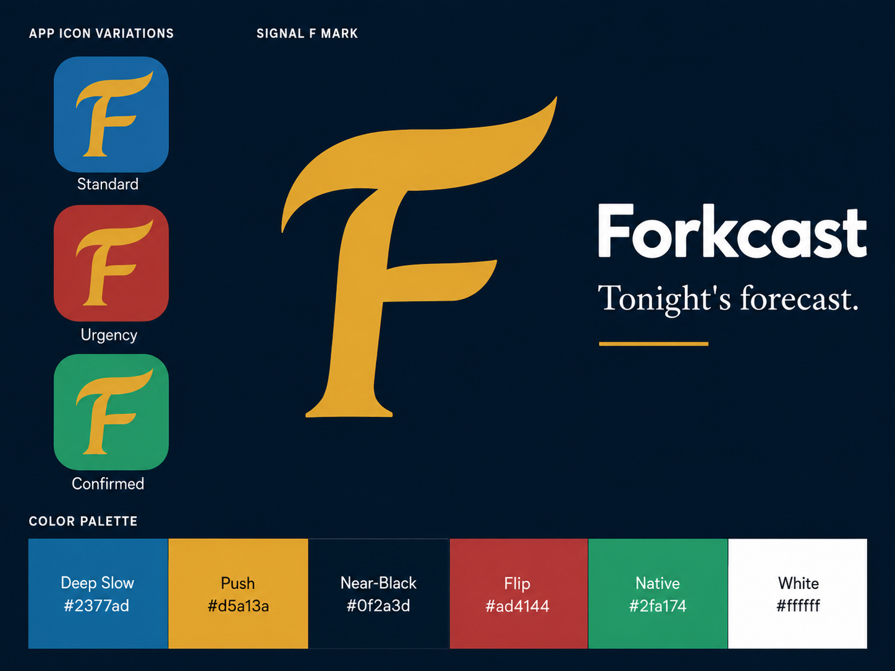
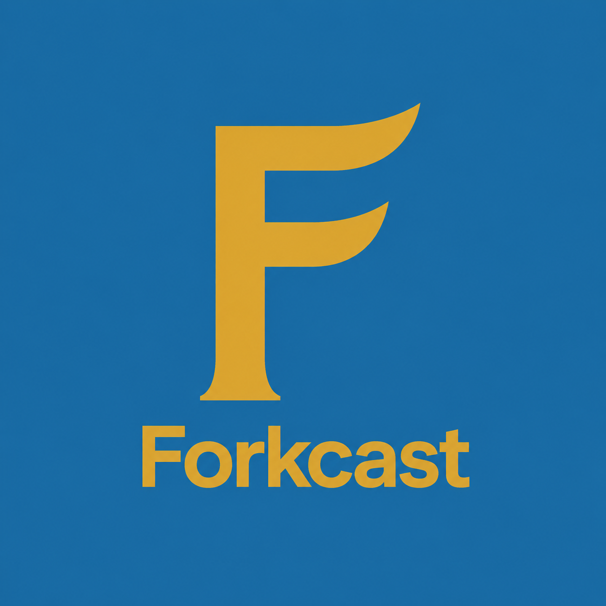
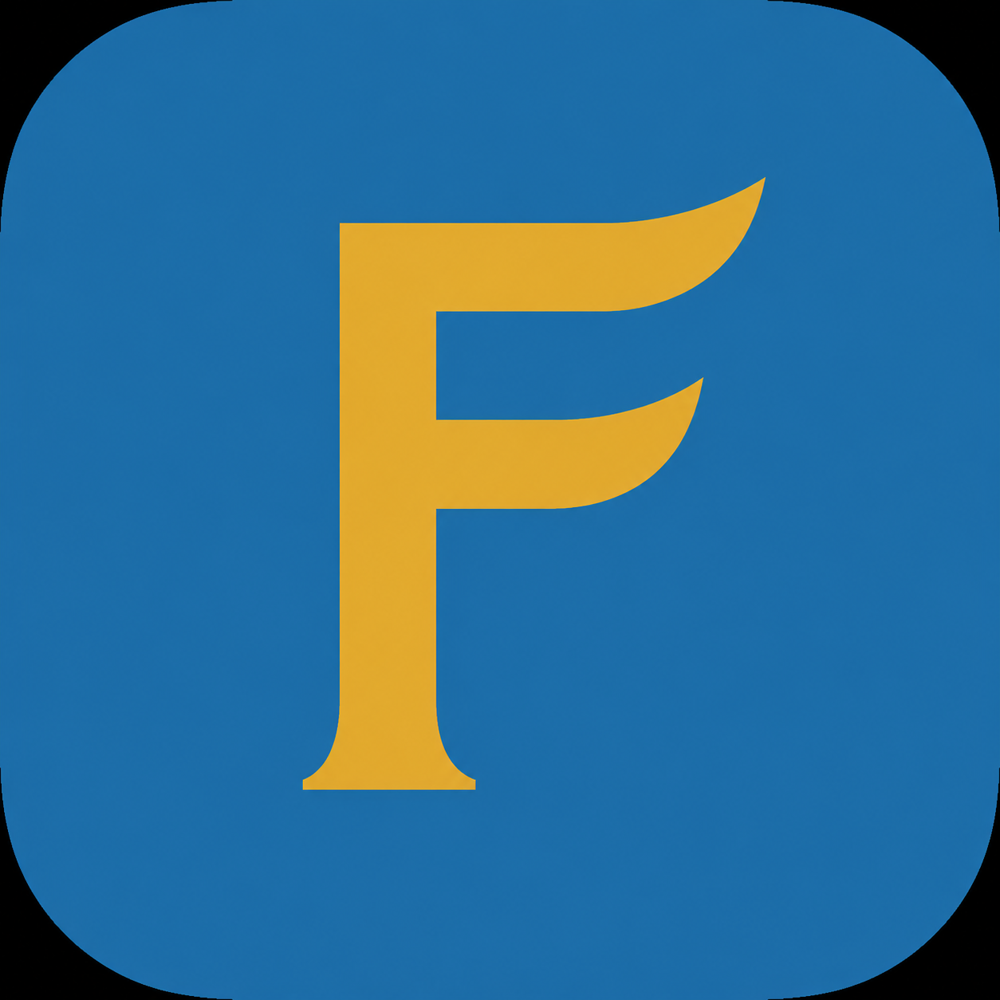
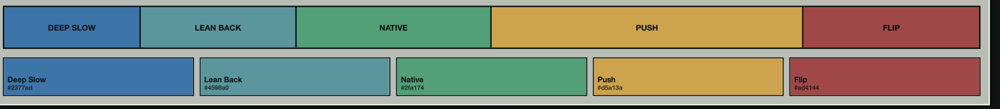
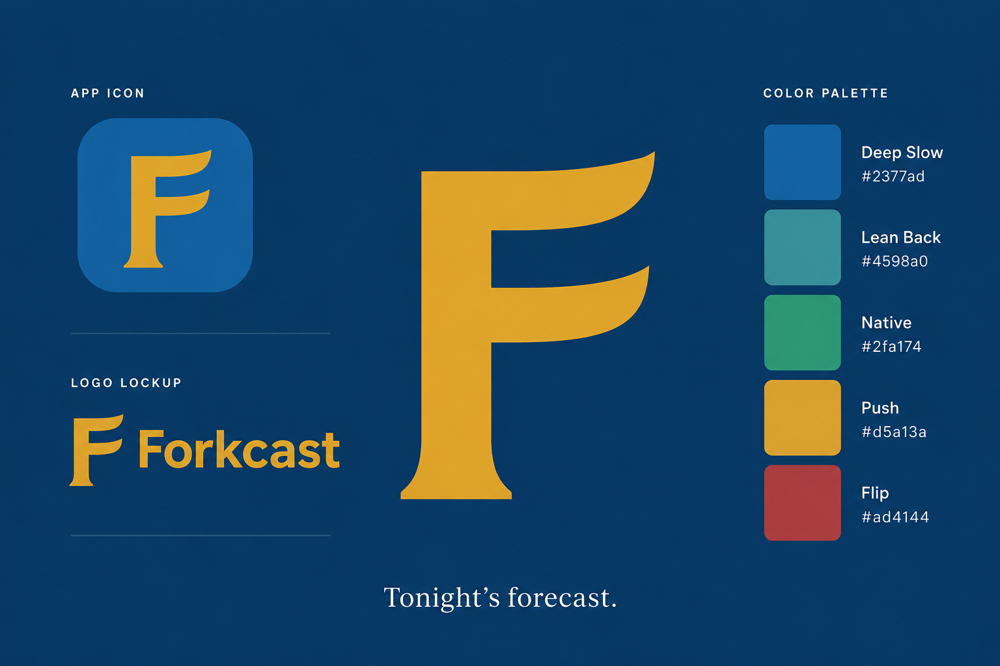

# Forkcast Brand Direction

This document locks the working brand direction for the Deal Finder product as Forkcast. It is the repo source of truth for brand strategy, voice, and visual direction until a production visual identity package replaces it.

## Brand Essence

Forkcast is the quick local read on what is worth going out for tonight.

The product should feel like local dining intelligence, not coupon hunting. A user opens Forkcast to get oriented quickly: where the worthwhile specials are, what applies tonight, and what to know before choosing a place.

## Positioning

Forkcast is the local dining forecast for restaurant specials, helping people decide where to go tonight without digging through stale posts, coupon apps, or review sites.

Short positioning:

> The local forecast for food specials worth knowing.

Plain-English product promise:

> See what is worth going out for tonight.

## Personality

- Clever, but never gimmicky.
- Modern, polished, and local.
- Specific and useful before it tries to be witty.
- Quietly confident, like a friend who knows the good special before dinner.
- Practical enough to help someone decide where to go.

Forkcast should not feel generic, corporate, coupon-like, or like a bland startup food app.

## Logo And App Icon Direction

The approved direction is the Signal F: a distinctive capital F that also reads as a fork silhouette.

Primary visual reference:

What is locked:

- Use an F-based primary mark.
- The mark should read as Forkcast first, not as a generic food icon.
- Use a single flat color for the mark.
- The core mark color is amber, `#d5a13a`.
- The primary icon background is deep blue, `#2377ad`.
- Weather, signal, or forecast imagery should stay secondary unless it avoids WiFi/radar confusion.

What remains provisional:

- Exact production vector.
- Batch 01 versus Batch 03 Signal F execution.
- Serif detail level at small sizes.
- App icon state variants.
- Splash animation.

Audit recommendation:

The brand direction is coherent and should be locked. The more editorial Batch 03 Signal F is promising, but should remain provisional until it is tested at app-icon sizes and translated into a clean vector. Batch 01 remains a useful warmer, broader-consumer reference if Batch 03 feels too premium or loses legibility.

Warmer consumer reference:

App icon reference:

Do not use the Weather Fork as the primary mark unless the arc treatment is redesigned. The current arc idea risks reading as WiFi, which would weaken the dining-specials positioning.

## Typography Direction

Use a modern grotesk for product UI. Use a tasteful serif only as a brand accent.

Recommended stack:

- Wordmark/display: Neue Haas Grotesk Display style, or a close fallback.
- UI/body: Plus Jakarta Sans or Inter style.
- Price/numeric: DM Mono style, used sparingly.
- Tagline accent: Playfair Display or Georgia style, used sparingly.

Do not let the serif voice take over the app UI. Forkcast should feel polished, not precious.

## Color Direction

The core palette is locked:

| Token | Hex | Use |
| --- | --- | --- |
| Deep Slow | `#2377ad` | Primary blue, app/icon background, navigation, brand field |
| Lean Back | `#4598a0` | Secondary surfaces, dividers, calm supporting states |
| Native | `#2fa174` | Saved, available, success, positive confirmation |
| Push | `#d5a13a` | Brand mark, primary action, deal energy |
| Flip | `#ad4144` | Urgency, expiring, caution, use sparingly |
| Near Black | `#0f2a3d` | Dark surfaces and preview backgrounds |
| Off White | `#faf7f2` | Warm light surfaces |

Usage guardrails:

- Deep Slow plus Push is the core brand pairing.
- Native and Flip are state colors, not the whole brand.
- Avoid making the product feel like a red/yellow coupon app.
- Keep browsing surfaces legible and practical. Do not make the app feel like a dark presentation deck unless the screen calls for it.

## Voice And Tone

Use forecast language lightly and naturally.

Good:

- Today's forecast.
- What is good tonight.
- Specials worth knowing.
- Know where to go tonight.
- Worth knowing before dinner.

Avoid:

- Explaining "fork plus forecast."
- Coupon language: clip, savings, hot deal, bargain, free deals.
- Empty urgency: do not miss out, last chance, hurry.
- Internal trust terms in public UI: proof, evidence, source capture, review task, confidence status, workflow status.
- Live-now language unless the data actually supports it.

Public users need practical information:

- restaurant
- deal
- valid day and time
- restrictions
- last confirmed date, if useful
- source link, if appropriate

## Tagline Ideas

Primary tagline:

> Today's forecast.

Strong supporting lines:

- What is good tonight.
- Specials worth knowing.
- Know where to go tonight.
- The local forecast for food specials.
- Worth knowing before dinner.

Campaign or longer-form lines:

- Not coupons. Not points. Just the local read on where to go tonight.
- The best special tonight should not be buried in a post from last week.

## Recommended Final Direction

Use:

> Forkcast: Today's forecast.

Position Forkcast as local dining intelligence for food specials, not as a discount finder. The brand should be clever and memorable, but the product must stay useful: open, scan, decide, go.

The visual system should start with the Signal F, Deep Slow, Push, and a restrained modern UI. Forecast language should give the product a point of view without turning every label into a weather metaphor.

## Official Now

- Product name: Forkcast.
- Name style: one word, capital F, lowercase the rest.
- Tagline: Today's forecast.
- Positioning: local dining forecast for food specials.
- Core promise: see what is worth going out for tonight.
- Guardrail: not coupons, not points, not a review site.
- Primary logo direction: Signal F.
- Core palette: Deep Slow plus Push, with Lean Back, Native, and Flip as supporting colors.
- Voice rule: clarity first, cleverness second.
- Platform reality: mobile-first web/PWA first; iOS language remains future-facing, not current scope.

## Asset Status

Available in repo:

- Palette reference: [forkcast-palette.png](brand-assets/forkcast-palette.png)
- Batch 03 brand preview: [forkcast-brand-preview-batch-03.png](brand-assets/forkcast-brand-preview-batch-03.png)
- Batch 01 brand preview: [forkcast-brand-preview-batch-01.png](brand-assets/forkcast-brand-preview-batch-01.png)
- Signal F logo reference: [forkcast-signal-f-logo-reference.png](brand-assets/forkcast-signal-f-logo-reference.png)
- Signal F app icon reference: [forkcast-signal-f-app-icon-reference.png](brand-assets/forkcast-signal-f-app-icon-reference.png)

Batch 01 preview:

External references reviewed on the local Desktop:

- Forkcast Codex handoff.
- Forkcast brand language and positioning.
- Forkcast visual asset log.
- Forkcast new visual concepts.
- Forkcast brand audit.

Assets to import when available:

- Final vector mark.
- Horizontal wordmark lockup.

Generated Phase 3 assets now available in `app/public/`:

- Signal F source SVG: `icon.svg`
- Favicon exports: `favicon.ico`, `favicon-16x16.png`, `favicon-32x32.png`
- App icon exports: `icon-192.png`, `icon-512.png`, `maskable-icon-512.png`, `apple-touch-icon.png`

The Phase 3 app icon suite is usable for the MVP PWA. The exact production vector and horizontal wordmark lockup remain provisional until tested on real devices and reviewed as a final identity package.
